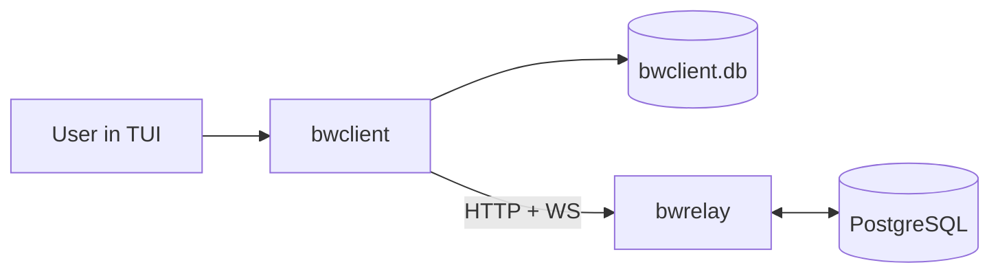
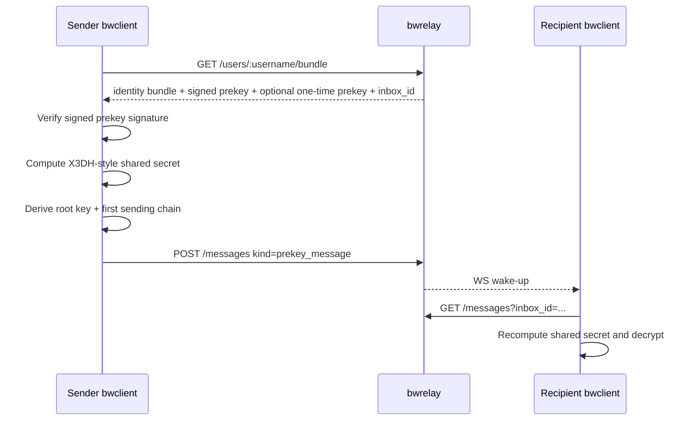
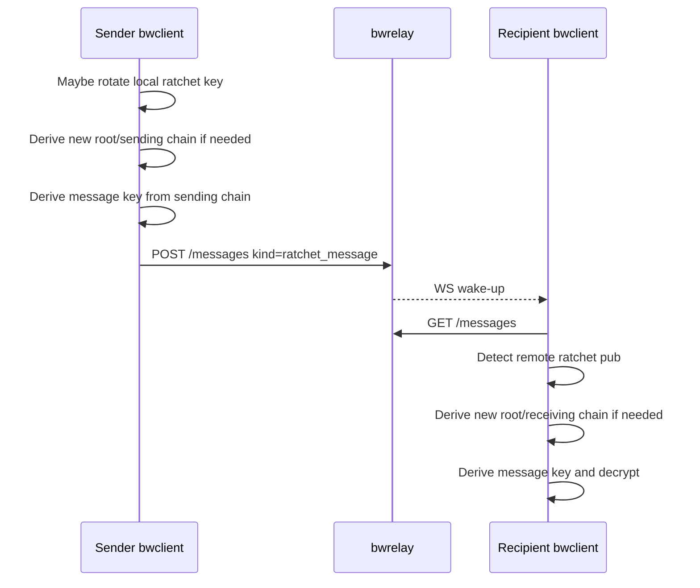

# bwclient

Terminal client for `bwrelay` with local identity management, local session state, and end-to-end encrypted message handling.

`bwclient` is the interactive client for BlackWire's relay model. It manages local profiles, generates and stores key material, publishes public bootstrap data to the relay, encrypts/decrypts messages locally, and renders conversations in a TUI. The relay remains a blind transport and mailbox layer.

## What It Is

`bwclient` is a local-first TUI client that:

- manages multiple relay servers
- manages multiple local profiles
- registers public bootstrap material on the relay
- encrypts and decrypts messages locally
- stores sessions, contacts, and history in local SQLite
- polls and subscribes for new relay messages
- exposes both chat UX and a technical panel for inspection

The client currently implements a project-specific v1 protocol. It is not a thin wrapper over Signal/libsignal.

## What It Is Not

`bwclient` is not:

- a trusted server
- a web client
- a stateless relay inspector only
- compatible with Signal protocol implementations out of the box
- encrypted at rest locally in this version

## Trust Model

The trust split is:

- `bwrelay` stores public bootstrap material and opaque envelopes
- `bwclient` owns all private keys, session state, encryption, and decryption

What the relay can see:

- usernames
- inbox IDs
- identity bundle public material
- signed prekeys
- one-time prekeys
- opaque headers
- opaque ciphertext
- timing and traffic volume

What the relay cannot see:

- private keys
- root keys
- sending/receiving chain keys
- plaintext message content
- local session state

Important current limitation:

- local data in `bwclient.db` is not encrypted at rest yet
- running two instances from the same directory shares the same SQLite file

## System Overview



`bwclient` has four important responsibilities:

1. Generate and persist local key material.
2. Publish public bootstrap material to the relay.
3. Perform local encryption/decryption and maintain ratchet state.
4. Render the current state in the terminal.

## Quick Start

Start the relay first from the sibling project:

```bash
cd ../bw-relay
docker compose up -d
docker exec -i bwrelay psql -U dev -d bwrelay < sql/schema.sql
go run ./cmd/bwrelay/main.go
```

Then run the client:

```bash
cargo run
```

Default local assumptions:

- relay API at `http://127.0.0.1:8080`
- relay websocket derived as `ws://127.0.0.1:8080/ws`
- local SQLite file at `./bwclient.db`

## TUI Usage

### First Run

On first launch:

1. Add a server.
2. Create a local profile.
3. Log in with that profile.
4. Add contacts by `username` or `inbox_id`.

### Main Controls

Login screen:

- `a`: add relay server
- `n`: create local profile on selected server
- `Tab`: switch focus between server list and profile list
- `Enter`: log in with selected profile
- `q`: quit

Main screen:

- `F1`: add contact
- `F2`: toggle technical panel
- `F5`: force sync
- `F6`: log out
- `F9`: enter compose mode
- `Esc`: leave compose mode and return to command mode
- `q`: quit from command mode

The composer has two modes:

- `Command`: navigation and shortcuts
- `Compose`: free text input for the outgoing message

## Local Configuration and Storage

The client stores state in SQLite:

```text
bwclient.db
```

Main persisted entities:

- `servers`: relay endpoints
- `profiles`: local identities bound to servers
- `contacts`: remote peers by username and/or inbox ID
- `conversations`: contact-thread state plus serialized ratchet session
- `messages`: decrypted messages, raw unresolved envelopes, and receive status

What is stored locally:

- signing private keys
- identity DH private keys
- signed prekey private keys
- one-time prekey private keys
- session state
- plaintext history
- raw relay headers/ciphertexts
- receive/decrypt failure reasons

This version does not encrypt the SQLite file.

## Relay Integration

`bwclient` uses the relay API exactly as a client should:

- `POST /users`
- `GET /users/:username/bundle`
- `POST /users/:username/prekeys`
- `POST /messages`
- `GET /messages`
- `GET /ws?inbox_id=...`

### Registration Flow

When creating a profile, the client:

1. Generates local key material.
2. Generates an `inbox_id`.
3. Serializes its public identity bundle.
4. Sends `POST /users`.

Registration payload fields:

- `username`: public discovery name
- `identity_key`: JSON containing public signing key and public identity DH key
- `signed_prekey`: public `X25519` signed prekey
- `signed_prekey_signature`: `Ed25519` signature over the signed prekey public bytes
- `inbox_id`: opaque mailbox capability
- `one_time_prekeys`: batch of public `X25519` one-time prekeys

### Polling and WebSocket

The relay websocket does not carry message payloads. It only acts as a wake-up signal.

Actual content retrieval always happens with:

```text
GET /messages?inbox_id=...&limit=...
```

The client:

- keeps a poll worker alive for the active profile
- subscribes to `/ws`
- triggers polling when websocket activity happens
- also polls periodically
- deduplicates by `relay_message_id`

## Cryptographic Model

The current implementation uses:

- identity signing key: `Ed25519`
- identity Diffie-Hellman key: `X25519`
- signed prekey: `X25519`
- one-time prekeys: `X25519`
- KDF: `HKDF-SHA256`
- AEAD: `ChaCha20-Poly1305`
- binary-to-text encoding: `base64url` without padding

This is a project-specific v1 design implemented in `src/crypto.rs`.

## Key Generation

Key generation happens in `generate_profile_material`.

For each new profile the client creates:

1. an `Ed25519` signing keypair
2. an `X25519` identity DH keypair
3. an `X25519` signed prekey keypair
4. an `Ed25519` signature over the signed prekey public bytes
5. a batch of `X25519` one-time prekeys
6. a random `inbox_id`

The public identity bundle published to the relay is serialized as:

```json
{
  "sign": "<base64url-ed25519-public>",
  "dh": "<base64url-x25519-public>"
}
```

The relay stores that JSON string in its `identity_key` field.

## Message Model

Two local protocol payloads matter:

### Public Identity Bundle

```json
{
  "sign": "<public signing key>",
  "dh": "<public identity DH key>"
}
```

### Message Header

```json
{
  "version": 1,
  "sender_username": "alice",
  "sender_inbox_id": "opaque-capability",
  "message_type": "prekey_message",
  "session_id": "uuid",
  "sender_identity_sign": "...",
  "sender_identity_dh": "...",
  "dh_pub": "...",
  "recipient_signed_prekey": "...",
  "used_one_time_prekey": "...",
  "pn": 0,
  "n": 0,
  "timestamp": "unix-seconds-as-string"
}
```

### Encrypted Payload

The plaintext content is wrapped as:

```json
{
  "text": "hello"
}
```

That JSON is encrypted with `ChaCha20-Poly1305`. The output written into the relay `ciphertext` field is:

```text
base64url( nonce || ciphertext_and_tag )
```

The `header` JSON is used as AEAD associated data.

## Message Flow

### Bootstrap / First Message



For the first message, the sender:

1. fetches the recipient bundle
2. parses `identity_key`
3. verifies the `signed_prekey_signature`
4. computes shared secret material from several DH operations
5. derives the initial `root_key`
6. derives the first sending chain
7. encrypts the payload
8. sends a `prekey_message`

The relay sees only the opaque envelope and associated public bootstrap material.

### DHs Used in the Initial Handshake

The sender combines:

- sender identity DH x recipient signed prekey
- sender ephemeral x recipient identity DH
- sender ephemeral x recipient signed prekey
- sender ephemeral x recipient one-time prekey, when present

The receiver reconstructs the same secret material using:

- local signed prekey x sender identity DH
- local identity DH x sender ephemeral
- local signed prekey x sender ephemeral
- local one-time prekey x sender ephemeral, when referenced

That shared material feeds `HKDF-SHA256` with the `blackwire/v1/x3dh` info string.

## Double Ratchet State

The session state is stored locally as `SessionState` and includes:

- `root_key`
- `sending_chain_key`
- `receiving_chain_key`
- local ratchet private/public key
- remote ratchet public key
- send and receive counters
- previous send count
- `pending_send_ratchet`

### Ratchet After Bootstrap



### Sending a Ratchet Message

For an existing session the sender:

1. checks whether a send ratchet step is pending
2. if needed, combines local ratchet private key with remote ratchet public key
3. derives a new `root_key` and new sending chain with `kdf_root`
4. derives the per-message `message_key` with `kdf_chain`
5. increments `send_count`
6. sends a `ratchet_message`

### Receiving a Ratchet Message

The receiver:

1. parses the header
2. compares the received `dh_pub` with the stored remote ratchet public key
3. if it changed, runs a root ratchet step
4. derives the current message key from the receiving chain
5. decrypts the payload
6. advances the receiving chain

## How Encryption Works

Payload encryption is done with:

- key: 32-byte message key derived from the current chain
- nonce: 12 random bytes
- associated data: serialized `header` JSON
- plaintext: serialized `EncryptedPayload`

The encrypted relay payload is:

```text
nonce || ciphertext || authentication_tag
```

Then `base64url` encoded.

## How Decryption Works

Decryption is the inverse:

1. parse the header JSON
2. derive or recover the correct message key from session state
3. decode `base64url`
4. split nonce from ciphertext
5. call `ChaCha20-Poly1305` decrypt with header JSON as associated data
6. deserialize `EncryptedPayload`

If any of those steps fail, the client now stores the raw envelope with a failure reason instead of silently dropping it.

## Sync and Error Handling

Incoming relay items move through these phases:

1. polled from relay
2. checked against local `relay_message_id` dedupe
3. parsed as header
4. routed to `prekey_message` or `ratchet_message`
5. decrypted when possible
6. stored in SQLite
7. rendered in the TUI

If a message cannot be fully processed, the client can store it as unresolved with statuses such as:

- `raw_unresolved`
- `decrypt_failed`
- `session_missing`
- `unsupported_header`

The TUI shows:

- `poll/stored/unresolved` counters
- unread conversations
- raw unresolved entries
- last receive error in the technical panel

## Current Limits and Caveats

Important limitations in the current code:

- local SQLite is not encrypted at rest
- protocol version is local/project-specific
- timestamps are currently simple epoch-second strings
- relay reads are non-destructive, so dedupe relies on `relay_message_id`
- running two client instances in the same directory shares `bwclient.db`
- some unresolved envelopes may appear as raw diagnostic messages instead of plaintext chat
- the current implementation is designed for internal consistency first, not protocol interoperability

## Developer Notes

Important code areas:

- `src/app.rs`: TUI flow, relay interaction, message ingest, rendering
- `src/crypto.rs`: key generation, bootstrap, ratchet, encryption, decryption
- `src/storage.rs`: SQLite persistence
- `src/relay.rs`: HTTP client for the relay
- `src/sync.rs`: polling and websocket wake-up worker
- `src/state/mod.rs`: local state and serialized session/message types

## Project Layout

```text
bwclient/
|- src/app.rs
|- src/crypto.rs
|- src/relay.rs
|- src/storage.rs
|- src/sync.rs
|- src/state/
|- Cargo.toml
`- bwclient.db
```

## License

AGPL-3.0-or-later
